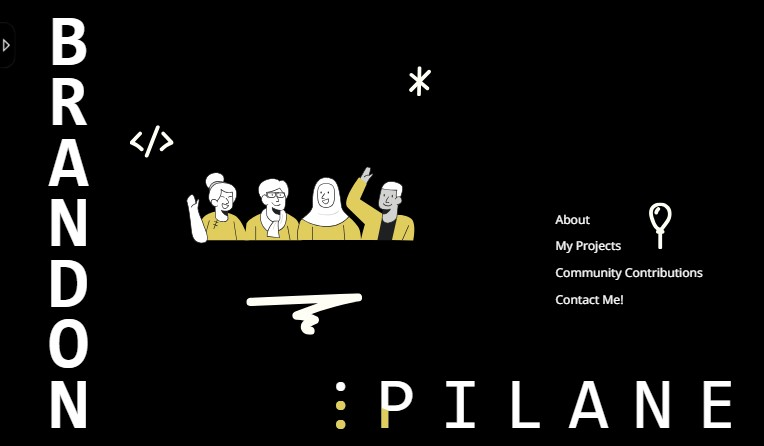

# Welcome to My Portfolio Website Repository!

This repository contains the source code and assets for a portfolio website. It serves as the central hub for development, collaboration, and version control of the website.

## Features

- **HTML/CSS/JavaScript:** The website is built using standard web technologies including HTML, CSS, and JavaScript, ensuring compatibility across a wide range of browsers and devices.
- **Responsive Design:** The website is designed to be responsive, providing an optimal viewing experience on various devices, from desktops to smartphones. //Not yet implemented 
- **Content:** The repository includes all text content, images, and multimedia assets used on the website, ensuring easy management and updates.
- **Version Control:** Git is used for version control, allowing for easy tracking of changes, collaboration among team members, and the ability to revert to previous versions if needed.
- **Issues and Pull Requests:** Developers can submit issues and pull requests to suggest changes, report bugs, or propose new features for the website.
<!-- - **Continuous Integration/Continuous Deployment (CI/CD):** Automated CI/CD pipelines are set up to streamline the development process, ensuring that changes are tested and deployed efficiently. -->

## Contributing

Contributions to the website are welcome! Whether you want to fix a bug, improve existing features, or add new functionality, feel free to fork the repository, make your changes, and submit a pull request. Please follow the contribution guidelines outlined in the repository to ensure smooth collaboration.

## Feedback

We value your feedback! If you have any suggestions, comments, or questions about the website or the repository, please don't hesitate to open an issue or reach out to the maintainers. Your input helps us improve and enhance the website for all users.

## License

Please refer to the LICENSE file for more details.
